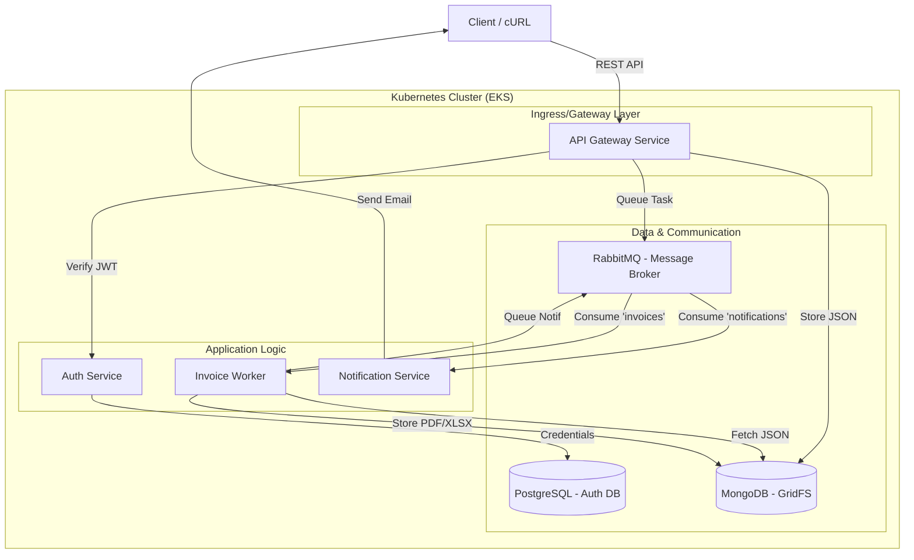
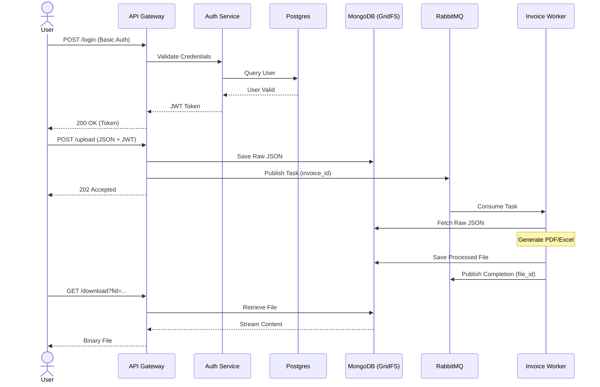
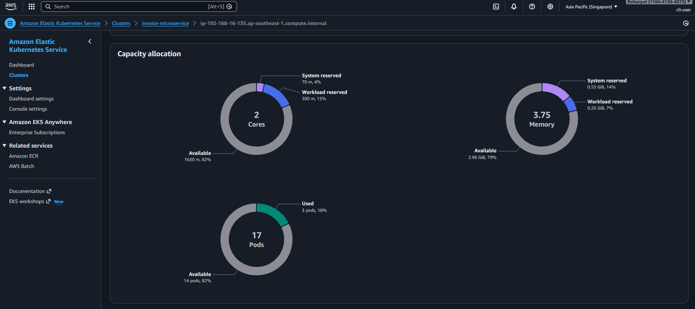

# Invoice Generator Microservice


## Project Overview

The Invoice Generator is a microservice-based application designed to handle asynchronous invoice processing. It allows users to upload invoice data via a REST API, which triggers a background worker to generate professional invoice files in multiple formats, including PDF, Excel, and CSV. 

Key capabilities include:
- Asynchronous document generation using a message broker.
- Secure user authentication and authorization.
- Distributed file storage for raw data and generated documents.
- Scalable deployment architecture suitable for cloud environments.

## System Architecture

The system follows a decoupled, event-driven microservices architecture designed for scalability and fault tolerance.

### Architecture Components



### Data Flow

The following sequence diagram details the internal process from authentication to file delivery:



### Technical Design Patterns

- Asynchronous Task Processing: Uses RabbitMQ to decouple the API Gateway from CPU-intensive generation tasks.
- Distributed Storage: Uses MongoDB GridFS to handle large files consistently across ephemeral containers.
- Stateless Authentication: Uses JWT to allow services to verify identity without constant database lookups.
- API Gateway Pattern: Provides a single entry point for routing, file transfers, and service orchestration.

## Tech Stack

| Category | Technology |
| :--- | :--- |
| Backend | Python (Flask, Pika, PyMongo) |
| Databases | PostgreSQL (Auth), MongoDB (GridFS Storage) |
| Messaging | RabbitMQ |
| Orchestration | Kubernetes (EKS) |
| Infrastructure | Helm, Docker |
| Security | JWT (PyJWT) |

## Docker Commands

These commands are used for building, tagging, and pushing the microservice images, as well as running the application locally.

### Local Development
```bash
docker-compose up --build
```

### Build Images
```bash
docker build -t auth-service ./src/auth-service
docker build -t gateway-service ./src/gateway-service
docker build -t invoice-worker ./src/invoice-worker
docker build -t notification-service ./src/notification-service
```

### Tag Images for Registry
```bash
docker tag auth-service:latest <DOCKER_USER>/auth:latest
docker tag gateway-service:latest <DOCKER_USER>/gateway:latest
docker tag invoice-worker:latest <DOCKER_USER>/worker:latest
docker tag notification-service:latest <DOCKER_USER>/notification:latest
```

### Push Images to Registry
```bash
docker push <DOCKER_USER>/auth:latest
docker push <DOCKER_USER>/gateway:latest
docker push <DOCKER_USER>/worker:latest
docker push <DOCKER_USER>/notification:latest
```

## Deployment Guide

### Kubernetes Deployment (via Helm)

1. Create EKS Cluster:
   Use `eksctl` to provision the cluster. This may take 15-20 minutes.
   ```bash
   eksctl create cluster \
     --name invoice-microservice \
     --region ap-southeast-1 \
     --nodegroup-name ng1 \
     --node-type t3.medium \
     --nodes 1 \
     --managed
   ```
   Once created, verify the connection:
   ```bash
   kubectl get nodes
   ```

2. Install Infrastructure:
   ```bash
   helm install postgres Helm_charts/Postgres
   helm install mongo Helm_charts/MongoDB
   helm install rabbit Helm_charts/RabbitMQ
   ```

3. Install Application:
   Update the image repositories in Helm_charts/InvoiceApp/values.yaml and run:
   ```bash
   helm install invoiceapp Helm_charts/InvoiceApp
   ```

## API Documentation & EKS Testing Guide

This section provides a comprehensive list of API endpoints, service URLs, and step-by-step instructions to verify your Invoice Generator deployment on an EKS cluster.

### 1. Service Endpoints (EKS/Public IP)

Assuming your EKS Node Public IP is `<PUBLIC_IP>`, the following services are accessible:

| Service | Port | Protocol | Purpose |
| :--- | :--- | :--- | :--- |
| **API Gateway** | `30080` | HTTP | Main entry point for the application |
| **PostgreSQL** | `30003` | TCP | Auth Database (Postgres) |
| **MongoDB** | `30005` | TCP | File Storage (GridFS) |
| **RabbitMQ AMQP** | `30004` | TCP | Message Broker (AMQP) |
| **RabbitMQ UI** | `31672` | HTTP | RabbitMQ Management Console |

### 2. API Endpoints Reference

All application requests should be sent to the **API Gateway** at `http://<PUBLIC_IP>:30080`.

#### A. Authentication
- **Endpoint**: `POST /login`
- **Auth**: Basic Auth (`username:password`)
- **Action**: Returns a JWT token for subsequent requests.
- **Default Credentials**: `test@example.com` / `password` (defined in `init.sql`)

#### B. Upload Invoice Data
- **Endpoint**: `POST /upload`
- **Query Param**: `format=pdf` (can be `pdf`, `excel`, or `csv`)
- **Header**: `Authorization: Bearer <JWT_TOKEN>`
- **Body**: Form-data with key `file` containing a JSON file (e.g., `sample_invoice.json`)
- **Action**: Stores raw JSON in MongoDB and queues a processing task.

#### C. Download Processed Invoice
- **Endpoint**: `GET /download`
- **Query Param**: `fid=<processed_fid>`
- **Header**: `Authorization: Bearer <JWT_TOKEN>`
- **Action**: Downloads the generated PDF/Excel/CSV file.

### 3. Step-by-Step Testing Guide (using cURL)

Follow these steps to verify the entire flow on your EKS cluster.

#### Step 1: Get your EKS Node Public IP
Find the public IP of one of your worker nodes:
```bash
kubectl get nodes -o wide
```
*Look for the `EXTERNAL-IP` column.*

#### Step 2: Login and Get Token
Execute this command to receive your JWT token:
```bash
# Store the token in a variable
TOKEN=$(curl -X POST http://<PUBLIC_IP>:30080/login \
  -u "test@example.com:password")

echo "Your Token: $TOKEN"
```

#### Step 3: Upload an Invoice for Processing
Upload the provided `sample_invoice.json` file.
```bash
curl -X POST "http://<PUBLIC_IP>:30080/upload?format=pdf" \
  -H "Authorization: Bearer $TOKEN" \
  -F "file=@sample_invoice.json"
```
*Expected Result: `success!`*

#### Step 4: Verify Processing in RabbitMQ
1. Open your browser to `http://<PUBLIC_IP>:31672`
2. Login with `ruhan` / `ruhan123`
3. Click on the **Queues** tab.
4. You should see `invoices` and `notifications` queues being active.

#### Step 5: Check Notification Logs
Verify the worker processed the file and the notification service sent an email:
```bash
# Check worker logs
kubectl logs -l app=worker

# Check notification logs
kubectl logs -l app=notification
```
*Look for the `processed_fid` in the logs.*

#### Step 6: Download the Generated File
Use the `processed_fid` from the logs/notification:
```bash
curl -X GET "http://<PUBLIC_IP>:30080/download?fid=<PROCESSED_FID>" \
  -H "Authorization: Bearer $TOKEN" \
  -o generated_invoice.pdf
```

### 4. Health Check Commands (Kubernetes)

Use these commands to quickly verify the status of your infrastructure:

#### Check Pod Status
```bash
kubectl get pods
```
*All pods should be `Running` with `1/1 READY`.*

#### Check Service Mappings
```bash
kubectl get svc
```
*Verify NodePorts are as expected.*

#### Check Detailed Pod Failures
If any pod is failing, use:
```bash
kubectl describe pod <pod-name>
kubectl logs <pod-name> --tail=50
```

### 5. Security Note for EKS

> [!IMPORTANT]
> Ensure your **EKS Security Group** allows inbound traffic on the following ports:
> - `30080`, `30003`, `30005`, `30004`, `31672`

## Result Showcase

### Infrastructure Overview
| EKS Cluster | Node Group |
| :---: | :---: |
|  |  |

### Generated Invoice


### Resource Allocation


---
Developed by Mian Al Ruhanyat - DevOps and Cloud Engineer
