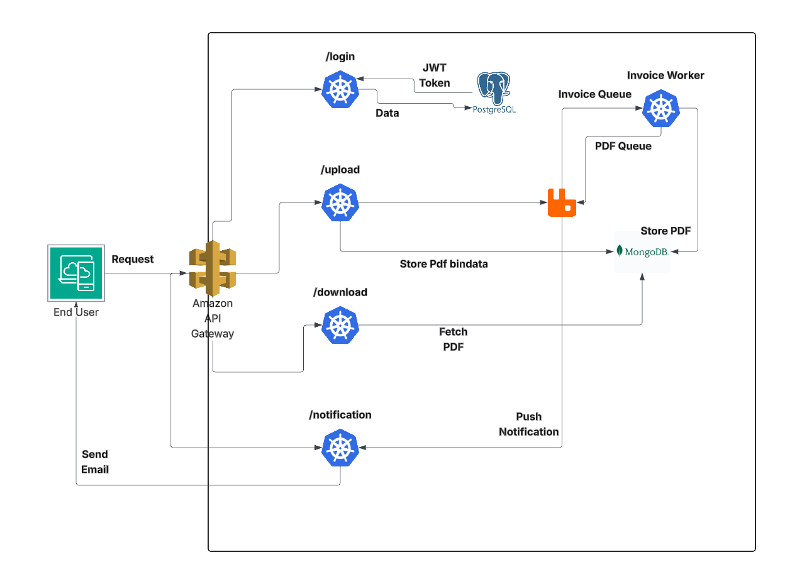

# Invoice Generator Microservice

[](https://kubernetes.io/)
[](https://helm.sh/)
[](https://www.python.org/)
[](https://www.postgresql.org/)
[](https://www.mongodb.com/)
[](https://www.rabbitmq.com/)

A robust, scalable microservice architecture for generating invoices in multiple formats (PDF, Excel, CSV). This project demonstrates modern cloud-native deployment practices using Kubernetes, Helm, and Docker.

## Project Overview

The Invoice Generator is designed to handle asynchronous invoice processing. Users can upload invoice data via a REST API, which triggers a background worker to generate the requested file. 

### Key Features
- Stateless Authentication: JWT-based secure access.
- Asynchronous Processing: Decoupled architecture using RabbitMQ for reliable background tasks.
- Polyglot Persistence: 
  - PostgreSQL for structured user and authentication data.
  - MongoDB (GridFS) for distributed storage of large invoice files.
- Multiple Formats: Support for PDF, Excel, and CSV generation.
- Cloud-Native: Optimized for deployment on AWS EKS or any Kubernetes cluster.

## Architecture



### Components
1. API Gateway: Entry point for all requests, handling routing and file transfers.
2. Auth Service: Manages user authentication and JWT token issuance.
3. Invoice Worker: Consumes tasks and generates the actual invoice files.
4. Notification Service: Sends email alerts when invoices are ready.

## Tech Stack
- Backend: Python (Flask, Pika, PyMongo)
- Infrastructure: Kubernetes, Helm Charts
- Databases: PostgreSQL, MongoDB
- Messaging: RabbitMQ
- Deployment: Docker, AWS EKS

## Deployment Guide

### Local Development (Docker Compose)
```bash
docker-compose up --build
```

### Production Deployment (Helm)

1. Configure Credentials:
   Update the `values.yaml` in each chart or use `--set` during installation.

2. Install Infrastructure:
   ```bash
   helm install postgres Helm_charts/Postgres
   helm install mongo Helm_charts/MongoDB
   helm install rabbit Helm_charts/RabbitMQ
   ```

3. Install Application:
   ```bash
   helm install invoiceapp Helm_charts/InvoiceApp
   ```

## API Reference

| Endpoint | Method | Purpose |
| :--- | :--- | :--- |
| `/login` | `POST` | Get JWT Token (requires Basic Auth) |
| `/upload` | `POST` | Upload JSON to generate invoice |
| `/download` | `GET` | Retrieve processed invoice |

##  Detailed Documentation

For a deeper dive into the technical details, refer to the following documents in the `Docs/` directory:

- [System Architecture](./Docs/Architecture.md): Detailed component analysis and data flow.
- [Deployment & Testing](./Docs/Deployment.md): Guide for Kubernetes deployment and E2E verification.
- [API Reference](./Docs/API_Reference.md): Complete list of endpoints and request/response schemas.
- [Optimization Walkthrough](./Docs/Optimization.md): Details on the Helm chart simplification and performance improvements.

## Showcase & Learning
This project was developed to master:
- Kubernetes: Orchestrating complex microservices and stateful workloads.
- Helm: Templating and managing Kubernetes applications efficiently.
- Distributed Systems: Handling asynchronous communication and distributed storage.
- Cloud Deployment: Designing for high availability and scalability on AWS EKS.

---
*Created by [ruhan] - DevOps & Cloud Engineer*
